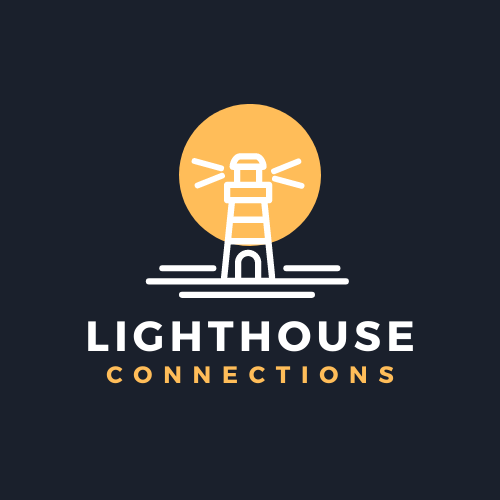

&nbsp;

    

&nbsp;

# Lighthouse 
Lighthouse makes it easier for people from various backgrounds to spark meaningful conversations and share their unique experiences and insights. 

 
Built using NextJS and Chakra UI
 

  

# Setup

## Authentication
Lighthouse uses Auth0 for user authentication. You can follow the (Auth0 Setup for NextJs)[https://auth0.com/docs/quickstart/webapp/nextjs/interactive] documentation

# Copyright & License
Copyright (c) 2022 Nicu Parente - Released under the [MIT License](./LICENSE).

